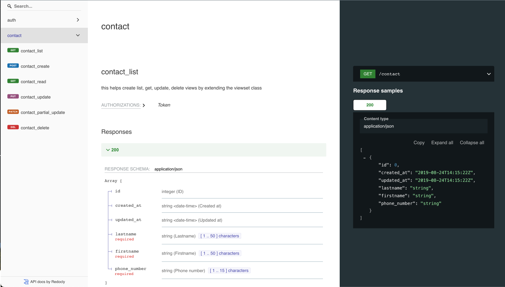

A Python-Django assessment task from [Hux Ventures](hello@hux.vc)

# Contact Application Backend in Python-Django


A simple implementation of a contact application written in Python.

## Features

- Basic authorization and authentication functionality.
- Welcome Aboard email to users.
- Basic Create, Update, Retrieve and Delete operations on contacts.

## Installation

1. Clone the repository:

   ```bash
   git clone git@github.com:olartbaraq/hux-assessment-backend.git
   cd hux-assessment-backend
   ```

2. Prepare a standalone environment using anaconda or any python env. creation tool:

   ```bash
   conda create hux-assessment-backend_env python=3.12
   conda activate hux-assessment-backend_env
   pip install -r requirements.txt
   create a .env file inside project root folder[contact]
   ```

3. Add the following variables to the env file:

   ```bash
   - `DEBUG`: True
   - `SECRET_KEY`: "django-insecure-4u=5=4o6y+=9#=oy#di9tmim_y0(a51yq!$py@hc)l8#4fe-@y"
   - `DB_NAME`: contact_db
   - `DB_USER`: root
   - `DB_PASSWORD`: testing
   - `DB_HOST`: 127.0.0.1
   - `DB_PORT`: 5464
   - `EMAIL_PORT`: 587
   - `EMAIL_HOST`: "smtp.gmail.com"
   - `EMAIL_HOST_PASSWORD`: check google on how to create an app password
   - `EMAIL_HOST_USER`: your app password gmail address
   ```

4. Download/Install Docker and run the following commands to setup your postgreSQL database:

   ```bash
   docker compose up -d
   docker exec -it contact-postgres createdb --username=root --owner=root contact_db
   python manage.py makemigrations
   python manage.py migrate
   ```

## Usage

1. Run the Django server :

   ```bash
   python manage.py runserver
   run https://127.0.0.1/8000/ to see all available endpoints and documentation.
   ```

## Basic example


